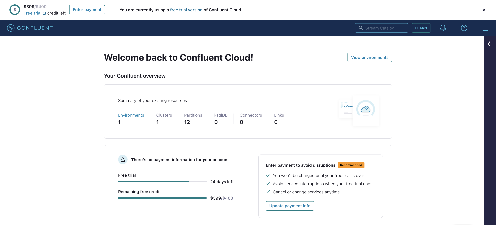
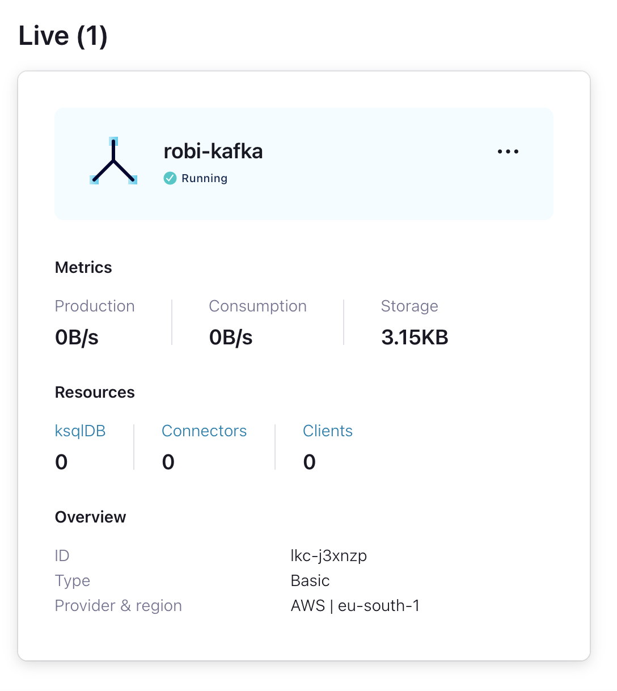
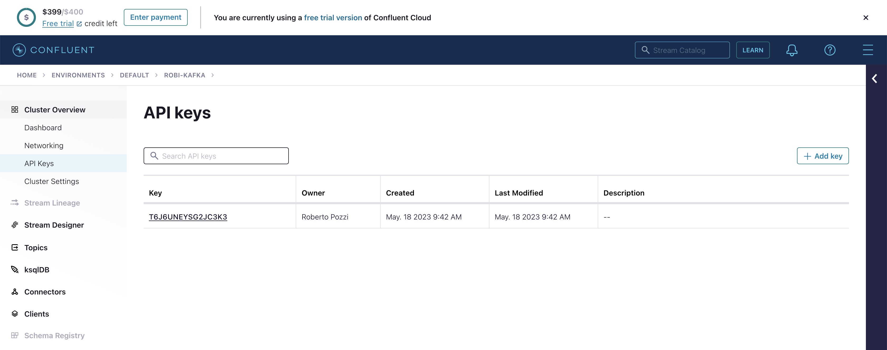
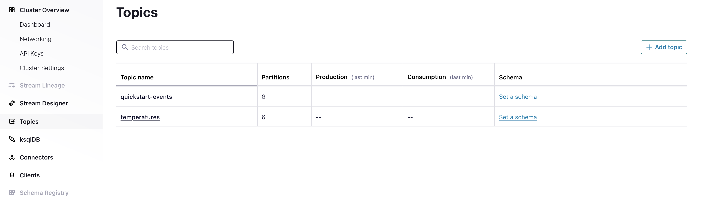
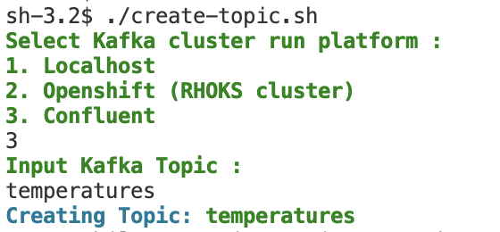

# Kafka
- [Introduction](#introduction)
- [Setup and run Kafka](#setup-and-run-kafka)
    - [Run Kafka cluster on local environment](#run-Kafka-cluster-on-local-environment)
    - [Run Kafka cluster on Confluent](#run-Kafka-cluster-on-confluent)
    - [Run Kafka cluster on Red Hat OpenShift](#run-Kafka-cluster-on-red-hat-openshift)
    - [Create, delete and describe Kafka topics](#create-delete-and-describe-kafka-topics)
    - [Producers and consumers using Kafka command line tools](#producers-and-consumers-using-Kafka-command-line-tools)
- [Nodejs examples](#nodejs-examples)
    - [Temperature simulation](#temperature-simulation)
    - [NPM Slack Notifier](#npm-slack-notifier)
- [Python examples](#python-examples)
    - [Using kafka-python library](#using-kafka-python-library)
    
## Introduction
This repository contains code and scripts to experiment on Kafka technology. See https://kafka.apache.org/intro for a general introduction to what Kafka is, how it works and which use cases is most suited for.

## Setup and run Kafka
This repository provides several scripts to interact with Kafka clusters, create and delete topics, produce and consume messages.

Start by cloning this repository with the following commands:

```
mkdir $HOME/dev
cd $HOME/dev
git clone https://github.com/robipozzi/robipozzi-kafka
```

Activate a Kafka cluster to interact with; instructions are provided to install Kafka locally or instantiate it on Confluent or Red Hat OpenShift.

### Run Kafka cluster on local environment
Installing Kafka locally for development and test is quite straightforward, please refer to https://kafka.apache.org/quickstart for instructions.

A couple of convenient scripts are provided to start the cluster, do the following in order:

* Open a terminal and run **[start-zookeeper.sh](deployments/local/start-zookeeper.sh)** that runs a local Zookeper (https://zookeeper.apache.org/) cluster.
```
cd $HOME/dev/robipozzi-kafka/deployments/local
./start-zookeeper.sh
```
* Open another terminal and run **[start-kafka.sh](deployments/local/start-kafka.sh)** that runs the actual Kafka cluster.
```
cd $HOME/dev/robipozzi-kafka/deployments/local
./start-kafka.sh
```

You are now ready to play with your local Kafka cluster.

### Run Kafka cluster on Confluent
Confluent (https://www.confluent.io/) is a technology company that designs and develops data platform which helps organizations harness business value from stream data. 

It provides the Confluent Cloud platform (https://confluent.cloud/), that allows to create Kafka clusters in a Cloud environment. Once you signup to Confluent Cloud, you will receive $400 credit to use the platform.



Once you are in the platform you can create a Kafka cluster, choosing the Cloud provider where the cluster will be provisioned.



To use the cluster there is just one final thing to do: create the API Key that the clients shall use to connect securely to the cluster.



Once everything is setup correctly as above, you can create all the topics needed by the application that shall use the cluster.




### Run Kafka cluster on Red Hat OpenShift
[TODO]

### Create, delete and describe Kafka topics
Kafka command line tools (available in /bin subdirectory of any local Kafka installation) allow to interact with Kafka clusters and operate many administrative tasks, like creating, deleting and describing topics.

Currently the code made available in this repo has been developed and tested against 3 different type of Kafka clusters, i.e.: local deployment, OpenShift and Confluent. Each deployment has its own connection and configuration parameters, that are available in the **[deployment](deployment)** subdirectory.

Convenient scripts are provided to:

* Create a topic: open a terminal and run **[create-topic.sh](create-topic.sh)**
```
cd $HOME/dev/robipozzi-kafka
./create-topic.sh
```

The script lets you choose the kind of Kafka cluster deployment you want to use (local, OpenShift or Confluent) and then asks to input the name of the Kafka topic you want to create, as seen in the following figure:



The script uses **kafka-topics.sh** Kafka command line tool with the **--create** argument and the appropriate configuration parameters for the specific Kafka cluster.

* Delete a topic: open a terminal and run **[delete-topic.sh](delete-topic.sh)**
```
cd $HOME/dev/robipozzi-kafka
./delete-topic.sh
```

The script uses **kafka-topics.sh** Kafka command line tool with the **--delete** argument and the appropriate configuration parameters for the specific Kafka cluster.

* Describe topics: open a terminal and run **[describe-topics.sh](describe-topics.sh)**
```
cd $HOME/dev/robipozzi-kafka
./describe-topics.sh
```
The script again uses **kafka-topics.sh** Kafka command line tool with the **--describe** argument and the appropriate configuration parameters for the specific Kafka cluster, to describe the configurations of all topics defined in the cluster.

### Producers and consumers using Kafka command line tools
Kafka is a distributed system consisting of servers and clients that communicate via a high-performance TCP network protocol. Clients allow to write distributed applications that read (consume, in Kafka terminology), write (produce, or publish, in Kafka terminology), and process streams of events in parallel.

Kafka provides command line tools to create and use producers and consumers.

Kafka command line tool **kafka-console-producer.sh** allows to connect to a Kafka cluster and publish messages to a specific topic. A convenient script named **test-producer.sh**, which uses *kafka-console-producer.sh*, is provided to test publishing messages to a selected Kafka topic.
```
cd $HOME/dev/robipozzi-kafka
./test-producer.sh
```

Kafka command line tool **kafka-console-consumer.sh** allows to connect to a Kafka cluster and publish messages to a specific topic. A convenient script named **test-consumer.sh**, which uses *kafka-console-consumer.sh*, is provided to test reading messages from a selected Kafka topic.
```
cd $HOME/dev/robipozzi-kafka
./test-consumer.sh
```

## Nodejs examples
Some application samples are provided to experiment with Kafka Nodejs clients.

* **[Temperature simulation](samples/nodejs/TemperatureSimulation/)** application simulates the behavior of a Temperature sensor, publishing temperature data to *temperatures* topic.

* **[NPM Slack Notifier](samples/nodejs/NPMSlackNotifier/)** application is yet to be implemented.

### Temperature simulation
Temperature simulation application is made of 2 Nodejs programs:

* **[temperatureSimulationProducer.js](samples/nodejs/TemperatureSimulation/temperatureSimulationProducer.js)** is Nodejs program that uses *kafkajs* Nodejs module to connect to a Kafka cluster and publish a message to *temperatures* topic.
Connection and other application parameters are configurable in **[kafkaConfig.js](samples/nodejs/TemperatureSimulation/config/kafkaConfig.js)** configuration file.

* **[temperatureSimulationConsumer.js](samples/nodejs/TemperatureSimulation/temperatureSimulationConsumer.js)** is Nodejs program that uses *kafkajs* Nodejs module to connect to a Kafka cluster and consume messages from *temperatures* topic.

### NPM Slack Notifier
[YET TO BE IMPLEMENTED]

## Python examples
[TODO]

### Using kafka-python library
[TODO]